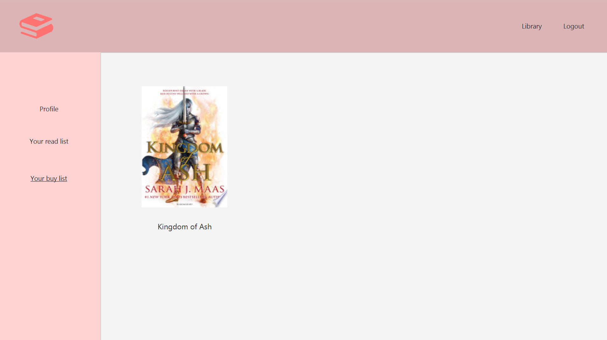

# Librarium - bibliotēka Jums uz datora!

---

## Navigācija
1. [Ievads](#ievads)
2. [Funkcijas](#funkcijas)
3. [Funkciju izskats lietotnē](#funkciju-izskats-lietotnē)
4. [Soli pa solim instrukcija kā lietot lietotni](#soli-pa-solim-instrukcija-kā-lietot-lietotni)
5. [Instalācijas process](#instalācijas-process)

---

## Ievads

Librarium ir bibliotēka uz jūsu datora lietotnes veidā. Veidota izmantojot JavaFX.
Tas ir veids apskatīt un iepazīties ar visādām grāmatām. Ja kāda iepatīkas un vēlies atzīmēt to,
tad šo grāmatu vari pielikt pie "Read List" jeb vēlos izlasīt vai "Buy List" jeb vēlos nopirkt.
Šeit ar dažādām filtrācijas metodēm vari apskatīt, ko arī citi vēlas izlasīt vai nopirkt.

---

## Funkcijas
* Izveidot savu kontu
* Pievienot grāmatas pie "Vēlos lasīt" vai "Vēlos nopirkt"
* Apskatīt dažādas grāmatas
* Atrast grāmatas pēc nosaukumiem
* Apskatīt grāmatas nosaukumu, autoru, aprakstu
* Atrast populāras grāmatas starp lietotājiem izmantojot filtra metdoes
* Aiziet uz savu profilu un nomainīt lietotājvārdu un paroli
* Profilā apskatīt grāmatas, kuras esat atzīmējuši

---

## Funkciju izskats lietotnē
* Izveidot savu kontu. Tikko atverot lietotni Jūs sagaidīs ieiešanas lapa,
bet spiežot uz poga "I don't have an account" Jūs varat izveidot kontu.

* Kad esat iegājuši, jums ir pieejamas visas grāmatas apskatei.

* Spiežot uz grāmatas nosaukumu Jūs tiksiet pārnesti uz šīs grāmatas lapu,
kur tur varat pievienot pie "Read List" ("Vēlos lasīt") vai "Buy List" ("Vēlos nopirkt").

* Izmantojot meklētāju var atrast grāmatu pēc nosaukuma.

* Var atrast grāmatas, kuras interesē citiem. Pēc cik daudz lietotāju un pievienojuši grāmatu
"Read List" ("Vēlos lasīt") vai "Buy List" ("Vēlos nopirkt").

* Profilā nomainīt paroli vai lietotājvārdu.

* Apskatīt, kuras grāmatas Jūs atzīmējāt, ka vēlaties izlasīt vai nopirkt.

---

## Soli pa solim instrukcija kā lietot lietotni

0. Apskatīties instalācijas procesu zemāk.

_Pirmo reizi atvēruši lietotni:_
1. Atverot lietotni jūs sagaida ieiešanas lapa.
   * Spiežot uz "I don't have an account" Jūs varēsiet reģistrēties lietonē ievadot savu lietotāj vārdu un paroli.
   * Tad spiežot pogu "Register" jūsu konts tiks izveidots un jūs varēsiet ieiet lietotnē.
     

_Kad konts ir izveidots:_
2. Jau kontu izveidojāt laiks ieiet iekša.
   * Ievadiet lietotājvārdu un Jūsu paroli laukos un spiežat "Login" pogu.
     

_Esat iegājuši kontā un jūs sagaida galvenā lapa:_
3. Tagad jūs esat galvenajā lapā. 
   * Šeit jūs varat apskatīt grāmatas. Izmantojot lapas lejā lapu pogas pārvietoties secīgi pa lapām.
   * Spiest uz grāmatu nosaukumiem, lai iepazītu grāmatu dziļāk un atzīmēt vai vēlos izlasīt, vai noprikt.
   * Ievadīt tekstu meklētāja lodziņā un meklēt grāmatas pēc nosaukuma.
   * Kārtot grāmatas no A-Z un Z-A secībā.
   * Filtrēt grāmatas pēc cik daudz lietotāju atzīmējuši sev, ka vēlas izlasīt vai nopirkt šo grāmatu.
   * Aiziet uz profilu un apskatīt kādas grāmatas Jūs esat atzīmējuši. Mainīt paroli un lietotājvārdu.
   * Un iziet no konta.
   

_Ja Jūs nospiedāt uz grāmatas nosaukuma:_
* Jūs redzat grāmatas aprakstu, nosaukumu, autoru.
* Iespēju atzīmēt grāmatu pie "Vēlos izlasīt" un "Vēlos nopirkt".
* Cik daudz citu lietotāju ir atzīmējuši, ka vēlas izlasīt vai nopirkt.

_Ja Jūs vēlaties izmantot meklēšanas rīku:_
* Ievadiet lodziņā labajā stūri grāmatas pilnu vai nepilnu tekstu.
* Spiežat pogu "Search".
* Tiks attēlotas grāmatas, kuras sakrīt pēc meklējuma.

_Ja Jūs vēlaties izmantot kārtošanas rīku:_
* Izvēlaties veidu kā vēlaties sakārtot grāmatas un spiežat (A-Z vai Z-A).

_Ja Jūs vēlaties izmantot filtrēšanu pēc lietotāju atzīmēto grāmatu daudzuma:_
* Var filtrēt pēc cik daudz atzīmējuši "Vēlas lasīt" un pēc cik daudz "Vēlas nopirkt", vai kopā.
* Var izmantot slīdni kā arī ierakstīt lodziņa vēlamo skaitli un grāmatas uzreiz attēlosies.

_Ja vēlaties aiziet uz profilu un veikt darbības tur:_
4. Katrā lapā ir iespējams aiziet uz profilu.
   * Aizejot uz profilu Jūs varat nomainīt savu lietotājvārdu vai paroli spiežot uz atbilstošajām pogām.
   * Kā arī kreisajā pusē izvēlēties no pogām, spiežot uz tām varat apskatīt kādas grāmatas Jūs esat atzīmējuši, ka vēlaties izlasīt vai nopirkt.
   
   

_Ja vēlaties iziet no konta:_
5. Katrā lapā Jums ir iespēja iziet no sava konta.
   * Augšējā labajā stūrī poga "Logout" to izdarīs. 
   

---

## Instalācijas process

1. Jums uz datora ir jābūt Maven un JDK, lai palaistu projektu
2. No github lejuppielādēt zip failu.
3. Unzippot zip failu.
4. To mapi atvērt ar jebkādu IDE (IntelliJ, Visual Studio code).
5. Palaist src/main/com/example/vadimaprojekts/HelloApplication
6. Un tālāk seko soli pa solim instrukcija.